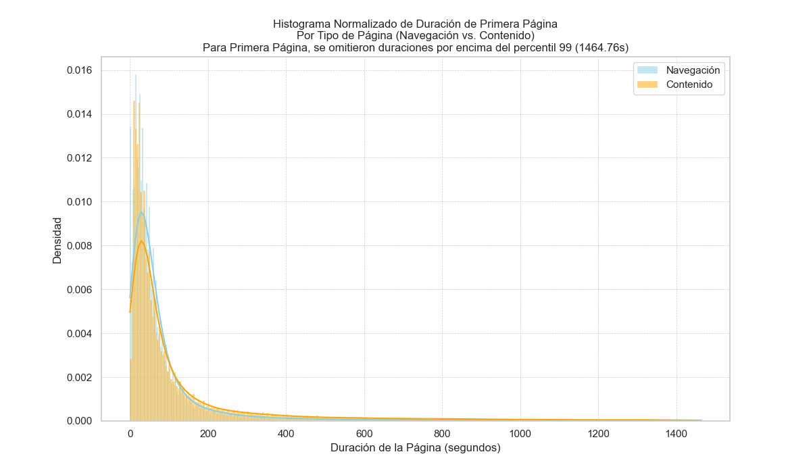

# Práctica 3: Minería de Uso de la Web - Memoria

## Introducción

[Breve introducción al proyecto, objetivos de la práctica y estructura del documento.]

## 1. Pre-procesamiento para análisis de logs

[Descripción general de la fase de pre-procesamiento.]

### 1.1. Carga del registro log y pre-procesamiento inicial

El proceso de carga y pre-procesamiento inicial del log de acceso de la NASA (`NASA_access_log_FULL.txt`) se realizó utilizando la biblioteca Pandas en Python. Los pasos principales fueron:
1.  **Lectura del Archivo:** Se leyó el archivo línea por línea.
2.  **Parseo de Líneas:** Cada línea se parseó utilizando una expresión regular (`LOG_PATTERN` en `src/preprocessing.py`) para extraer los campos relevantes: Host remoto, Fecha/Hora, Método HTTP, Página solicitada, Protocolo HTTP, Código de estado HTTP (Resultado) y Tamaño de la respuesta.
3.  **Creación del DataFrame:** Los datos parseados se cargaron en un DataFrame de Pandas con las columnas: 'Host remoto', 'Fecha/Hora', 'Método', 'Página', 'Protocolo', 'Resultado', 'Tamaño'.
4.  **Conversión de Tipos:**
    *   La columna 'Resultado' (código de estado) se convirtió a tipo numérico.
    *   La columna 'Tamaño' se convirtió a tipo numérico, manejando los valores '-' como NaN.
    *   La columna 'Fecha/Hora' se convirtió a objetos `datetime` de Pandas, utilizando el formato `%d/%b/%Y:%H:%M:%S %z`. Se verificó la presencia de valores NaT (Not a Time) resultantes de errores de conversión.
5.  **Creación de Marca de Tiempo:** Se creó una nueva columna 'marca de tiempo'. Para ello, primero se convirtió la columna 'Fecha/Hora' a UTC (Coordinated Universal Time) para asegurar una referencia temporal consistente. Luego, se calculó la diferencia en segundos entre cada entrada de 'Fecha/Hora_UTC' y la fecha de referencia (1 de Enero de 1995, 00:00:00 UTC).

### 1.2. Filtrado de datos

*   **Tabla de Extensiones Más Repetidas:**
    Se extrajeron las extensiones de la columna 'Página' y se contó su frecuencia. La tabla con las 10 extensiones más repetidas se generó y guardó en `output/tables/top_10_extensions.csv`. Su contenido es el siguiente:

    ```
    Extensión,Número de Repeticiones
    gif,1986781
    html,750366
    xbm,110249
    jpg,79638
    pl,65304
    txt,51483
    mpg,44657
    htm,22623
    jpeg,12170
    wav,6686
    ```

*   **Explicación del Filtrado:**
    Los pasos de filtrado (identificar las N extensiones de archivo principales y luego conservar solo extensiones específicas o extensiones en blanco) son cruciales por varias razones en el contexto del análisis de logs web:
    1.  **Enfoque en Contenido Relevante:** Los logs del servidor web capturan solicitudes para todo tipo de recursos, incluyendo imágenes (`.gif`, `.jpg`), hojas de estilo (`.css`), archivos JavaScript (`.js`) y páginas de contenido reales (`.html`, `.pdf`, etc.). Para muchos tipos de análisis (p.ej., comprender patrones de navegación del usuario, documentos de contenido populares), las solicitudes de archivos auxiliares como imágenes o scripts son ruido. El filtrado ayuda a aislar las solicitudes de contenido primario o elementos de navegación. Las extensiones elegidas (`.htm`, `.html`, `.pdf`, `.asp`, `.exe`, `.txt`, `.doc`, `.ppt`, `.xls`, `.xml`) generalmente representan dicho contenido primario o documentos descargables.
    2.  **Manejo de Casos "Sin Extensión":** Conservar registros donde la extensión de la página está en blanco es importante porque a menudo representan solicitudes de directorios (p.ej., `/ruta/al/directorio/`) o páginas dinámicas donde la extensión no es explícitamente parte de la URL visible para el usuario (p.ej., URLs limpias como `/productos/`). Estos son a menudo centrales para la navegación del sitio y la interacción del usuario. Por ejemplo, una solicitud a `/imagenes/` (sin extensión) podría servir un archivo `index.html` por defecto, representando un punto de navegación.
    3.  **Reducción del Volumen de Datos:** Los logs web pueden ser enormes. Filtrar solicitudes menos relevantes (basadas en extensiones consideradas menos importantes para los objetivos específicos del análisis) reduce significativamente el tamaño del conjunto de datos. Esto hace que el procesamiento, análisis y visualización subsiguientes sean más rápidos y manejables.
    4.  **Mejora de la Precisión del Análisis:** Al eliminar solicitudes de recursos incrustados (como imágenes dentro de una página HTML), los análisis como "páginas por sesión" o "tiempo empleado en la página" se vuelven más precisos. Si cada solicitud de imagen se contara como una "vista de página" separada, estas métricas estarían muy sesgadas y no reflejarían el comportamiento real del usuario con respecto al consumo de contenido.
    5.  **Simplificación del Análisis de Extensiones:** El paso de extraer todas las extensiones y encontrar las N principales (Tarea 1.2.1) ayuda a comprender la composición de las solicitudes al servidor. Este conocimiento puede luego informar la estrategia de filtrado en la Tarea 1.2.2 (conservar extensiones específicas). Por ejemplo, si una extensión inesperada pero importante aparece en la lista principal, podría agregarse a las extensiones a conservar.

### 1.3. De-spidering

Se implementó una estrategia para identificar bots y crawlers basada en el acceso al archivo `/robots.txt`. Los hosts que solicitaron este archivo fueron marcados como bots. Según la ejecución del script `src/preprocessing.py`:
1.  Se identificaron **55 hosts únicos** que accedieron a `/robots.txt`.
2.  Se añadió una nueva columna booleana `Is_Bot` al DataFrame principal.
3.  Las peticiones de estos hosts identificados como bots constituyeron **8608 peticiones**, lo que representa aproximadamente el **0.76%** del total de peticiones en el DataFrame filtrado por extensiones.
4.  Se generaron dos tablas de resumen en formato CSV, guardadas en el directorio `output/tables/`:
    *   `identified_bots_details.csv`: Contiene una lista de los 'Host remoto' identificados como bots y el número total de peticiones realizadas por cada uno (ej. `e659229.boeing.com` con 2296 peticiones).
    *   `bot_proportions_summary.csv`: Muestra el número total de peticiones de los bots identificados frente a las peticiones no identificadas como de bots, junto con sus proporciones relativas.

*   **Explicación del De-spidering:**
    El proceso de "de-spidering" (identificación y eliminación de registros de bots y crawlers) es crucial para el análisis de logs web. Su objetivo principal es **centrarse en el comportamiento humano**, ya que los bots (ej. indexadores de motores de búsqueda) tienen patrones de acceso muy diferentes que pueden distorsionar métricas clave. Incluir tráfico de bots infla el número de visitas, altera las características de las sesiones (duración, páginas por sesión) y puede mostrar una popularidad irreal de ciertos contenidos. Al eliminar estas entradas automatizadas —en nuestro caso, identificando los hosts que accedieron a `/robots.txt` y luego filtrando sus peticiones— se **mejora la precisión de los análisis** y se **reduce el ruido y el volumen de datos**. Esto permite que los patrones de comportamiento de los usuarios reales emerjan más claramente, llevando a conclusiones más fiables sobre la interacción con el sitio web.

### 1.4. Identificación de usuarios

Para la identificación de usuarios, se consideraron los campos disponibles en el log:
*   **Campos 'ident' y 'user':** Como se determinó en la Tarea 1.1.2 y se confirmó en la Tarea 1.4.1, los campos del log que corresponderían a 'ident' (equivalente a 'Contraseña' en la terminología inicial del proyecto) y 'user' (equivalente a 'Usuario') son consistentemente '-' en los datos. Por lo tanto, no fueron capturados como columnas en el DataFrame final y no aportan información para la identificación de usuarios.
*   **Campo 'Referrer':** El formato de log que se está procesando (Common Log Format con algunos añadidos, pero no extendido para incluir explícitamente el referrer como un campo estándar separado en la línea principal del log) no proporciona directamente un campo 'referrer' a través del patrón de expresiones regulares actual (`LOG_PATTERN` en `src/preprocessing.py`). Aunque la información del referrer podría estar en las cabeceras HTTP completas (no disponibles en estos logs), no es un campo que se parsea actualmente. Un análisis basado en la topología del sitio para inferir referrers internos requeriría un conocimiento detallado de la estructura del sitio web que está fuera del alcance de este preprocesamiento.
*   **Campo 'Host remoto' (IP):** Este campo es el candidato principal para la identificación de usuarios en ausencia de otros identificadores más fiables.

La estrategia para crear un 'UserID' se basará en el campo 'Host remoto'.

### 1.5. Identificación de sesiones

La identificación de sesiones se implementó en la función `identify_sessions` dentro de `src/preprocessing.py`. El proceso es el siguiente:
1.  **Ordenamiento:** El DataFrame se ordena primero por la columna 'UserID' (creada en el paso 1.4.3) y luego por la columna 'marca de tiempo'.
2.  **Cálculo de Diferencias de Tiempo:** Para cada usuario, se calcula la diferencia de tiempo (en segundos) entre cada petición consecutiva.
3.  **Detección de Inicio de Sesión:** Una nueva sesión comienza si es la primera petición del 'UserID' o si la diferencia de tiempo con la petición anterior excede 30 minutos (1800 segundos).
4.  **Asignación de 'SessionID':** Se genera un `SessionID` único concatenando el 'UserID' con un número de secuencia de sesión (e.g., `199.72.81.55_1`).

El script `src/preprocessing.py` reportó la creación de **289,666 sesiones únicas identificadas**. También imprime ejemplos de estas sesiones.

*   **Ejemplo de Tabla de Sesiones:**
    A continuación, se muestra un ejemplo de la salida del script `src/preprocessing.py`, ilustrando el formato de las sesiones. El DataFrame resultante está ordenado por `UserID` y `marca de tiempo`:

    | UserID      | marca de tiempo | SessionID     | Página                                      |
    |-------------|-----------------|---------------|---------------------------------------------|
    | ***.novo.dk | 16546629.0      | ***.novo.dk_1 | /ksc.html                                   |
    | ***.novo.dk | 16546668.0      | ***.novo.dk_1 | /shuttle/missions/missions.html             |
    | ...         | ...             | ...           | ...                                         |
    | ***.novo.dk | 19033368.0      | ***.novo.dk_2 | /shuttle/missions/sts-69/mission-sts-69.html|
    | ...         | ...             | ...           | ...                                         |


### 1.6. Problemas al estimar duraciones

*   **Discusión sobre la Última Página:**
    Estimar con precisión cuánto tiempo un usuario dedica a la última página de una sesión es un problema inherente y bien conocido en el análisis de logs web. La dificultad principal radica en que los logs del servidor registran cuándo se solicita una página, pero **no registran cuándo el usuario la abandona o cierra su navegador**.

    Para todas las páginas intermedias de una sesión, podemos inferir el tiempo de visualización de una página `A` como la diferencia entre la marca de tiempo de la solicitud de la página `A` y la marca de tiempo de la solicitud de la siguiente página `B` (dentro de la misma sesión). Asumimos que el usuario estuvo viendo la página `A` hasta que solicitó la página `B`.

    Sin embargo, para la última página de la sesión, no hay una "siguiente página solicitada" en el log que marque el final de su visualización. El usuario podría haber:
    *   Leído la página durante unos segundos y luego cerrado la pestaña/navegador.
    *   Leído la página detenidamente durante varios minutos.
    *   Dejado la página abierta en una pestaña del navegador durante horas mientras realizaba otras actividades (online u offline).
    *   Experimentado un problema de conexión o el cierre inesperado del navegador.

    El log del servidor no puede distinguir entre estos escenarios. Por lo tanto, cualquier cálculo directo del tiempo de visualización para la última página basado únicamente en los timestamps del log es imposible. Esto significa que si simplemente omitimos la duración de la última página, la duración total de la sesión y el tiempo medio por página pueden ser subestimados, especialmente en sesiones cortas o en sitios donde la última página es crucial (por ejemplo, una página de confirmación, un artículo largo).

*   **Sugerencia Creativa para Estimación:**
    Para estimar la duración de la visualización de la última página de una sesión, una aproximación consiste en **utilizar el tiempo medio de visualización de páginas similares** dentro del mismo dataset. Los pasos serían:

    1.  **Calcular Duraciones Conocidas y Medias Contextuales:**
        *   Primero, para todas las páginas que *no* son la última de su sesión, se calcula su duración (tiempo hasta el siguiente hit en la misma sesión).
        *   Luego, se calcula el tiempo medio de visualización para estas páginas, preferiblemente agrupando por un contexto relevante, como la extensión del archivo (ej. media para `.html`, media para `.pdf`, media para páginas sin extensión).

    2.  **Aplicar Duración a la Última Página:**
        *   A la última página de cada sesión se le asignaría la duración media precalculada correspondiente a su tipo o extensión. Por ejemplo, si la última página es un `.html`, se usaría la duración media de las páginas `.html` (no finales) calculada previamente.
        *   Si para un tipo específico de última página no hay una media contextual disponible (ej. extensión poco común), se podría recurrir a una media global de todas las páginas no finales.

    **Consideraciones y Limitaciones:**
    *   Esta técnica asume que la última página se consume de forma similar a otras páginas del mismo tipo que no fueron las últimas, lo cual es una generalización.
    *   No puede capturar la variabilidad individual de la visualización de la última página (abandono rápido vs. lectura prolongada).
    *   A pesar de sus limitaciones, esta imputación basada en datos es más informada que ignorar la duración o asignar una constante arbitraria.

    Una alternativa más simple sería asignar un valor constante predefinido (ej., 30 segundos), aunque esto carece de la adaptación a los datos que ofrece el método de la media contextual.

### 1.7. Pre-procesamiento adicional

Se revisó el DataFrame final (`df_final_processed` en el script `src/preprocessing.py`, después de la eliminación de bots y la creación de UserID y SessionID) para identificar valores perdidos (NaN) en columnas críticas.

1.  **Identificación de Valores Perdidos:**
    *   Basándose en la salida del método `.info()` del DataFrame, la mayoría de las columnas críticas para el análisis de sesiones y comportamiento del usuario (como `UserID`, `Fecha/Hora`, `marca de tiempo`, `Página`, `Extensión`, `SessionID`) no presentan valores perdidos.
    *   La columna `Tamaño` sí presenta valores NaN. Esto es un resultado esperado, ya que el script convierte las entradas "-" (guion) del log original en NaN cuando la columna `Tamaño` se convierte a tipo numérico. En la ejecución de ejemplo, se observaron aproximadamente 25,461 NaNs en esta columna sobre un total de 1,124,516 filas en el DataFrame procesado sin bots.

2.  **Estrategia de Tratamiento:**
    *   **Para la columna `Tamaño`:** Los valores NaN se consideran una representación válida de datos originalmente no disponibles (el servidor no reportó el tamaño del objeto). No se realizará una imputación general (como rellenar con 0 o la media) en esta etapa del preprocesamiento. Si análisis futuros específicos requieren un valor numérico en `Tamaño` para todos los registros (ej. cálculo de bytes totales promedio por sesión incluyendo estas peticiones), se abordará en ese momento (ej. tratando NaN como 0 para sumas, o excluyendo el registro si la media de tamaño es crítica y el NaN no puede ser significativamente interpretado).
    *   **Para otras columnas críticas:** Dado que no se identificaron NaNs, no se requiere tratamiento adicional.

Este enfoque asegura que no se introduce información artificial en el DataFrame y que la naturaleza de los datos originales se preserva en la medida de lo posible.

## 2. Análisis exploratorio de datos del log

[Descripción general de la fase de análisis exploratorio.]

**Nota sobre Visualizaciones:**
*   [Si se omitieron valores atípicos en histogramas o diagramas de dispersión para mejorar la visualización, indicar aquí de forma general. Luego, en cada sección específica, detallar el umbral utilizado y la proporción de registros omitidos para ESE gráfico/análisis en particular.]

### 2.1. Duración de la sesión

*   **Discusión sobre Sesiones de Única Visita:**
    *   Las sesiones que constan de una única visita (a menudo denominadas "rebotes" o "bounces") presentan un desafío particular para la estimación de su duración cuando se analizan exclusivamente logs de servidor. Desde la perspectiva del log del servidor, si solo hay un hit para una sesión, no hay un segundo hit para calcular una diferencia de tiempo. Por lo tanto, la duración *medida* de tal sesión es efectivamente cero.
    *   Sin embargo, es evidente que el usuario pasó *algún* tiempo en esa única página. La evidencia empírica sobre la duración real de estas visitas proviene principalmente de:
        1.  **Analíticas del Lado del Cliente:** Herramientas como Google Analytics, que ejecutan JavaScript en el navegador del usuario, pueden medir el tiempo en página de forma más precisa, incluso para visitas a una sola página. Lo hacen enviando "pings" o eventos al servidor de analíticas a intervalos regulares o cuando el usuario realiza acciones como hacer scroll o interactuar con elementos, o justo antes de que la página se cierre.
        2.  **Estudios de Comportamiento del Usuario:** Investigaciones académicas y de la industria sobre usabilidad web y comportamiento del usuario a menudo analizan el tiempo en página. Estos estudios confirman la dificultad de medir la duración de los rebotes solo con logs de servidor y pueden ofrecer estimaciones promedio o modelos para imputar estas duraciones.
        3.  **Imputación en Análisis de Logs:** En el análisis de logs de servidor, se debe reconocer esta limitación. Si es necesario asignar una duración a las sesiones de una sola visita para análisis posteriores (por ejemplo, para calcular una duración media general de la sesión), se podría imputar un valor. Esto podría ser una duración corta y fija (ej. unos pocos segundos, asumiendo que el usuario se fue rápidamente), el tiempo medio de carga de la página, o la duración media de visualización de esa página específica si se conoce de otras sesiones de múltiples visitas. No obstante, cualquier valor asignado es una estimación. Para este análisis, se reconocerá que la duración medida es cero, y se tratarán estas sesiones como un caso especial si es necesario.

*   **Análisis de Duración de Sesiones (>1 visita):**
    *   Cálculo de la duración: Para las sesiones con más de una visita (después de la eliminación de sesiones automáticas en el paso 2.3.3), la duración se calculó como la diferencia entre la marca de tiempo del último y el primer hit de la sesión.
    *   **Histograma de Duración de Sesión:**
        *   El histograma de la duración de las sesiones (con >1 visita, después del filtrado de sesiones rápidas del paso 2.3.3) se guardó como `output/graphics/analysis/session_duration_histogram_after_2.3.3_filter.png`.
        *   Nota sobre la visualización del histograma (basada en la ejecución que generó `session_duration_histogram_notes.txt` - se asume que una lógica similar de capping se aplicó al histograma filtrado): Para mejorar la visualización, se omitieron los valores de duración de sesión por encima del percentil 99 (aproximadamente 4410.52 segundos en una de las ejecuciones). Esto afectó a un pequeño porcentaje de sesiones (ej. 1.00% en esa ejecución).
        *   
    *   **Resumen Estadístico de Duración de Sesión:**
        *   El resumen estadístico para la duración de la sesión (en segundos), después de eliminar las sesiones rápidas (paso 2.3.3), es el siguiente (contenido de `output/graphics/analysis/session_duration_stats_after_2.3.3_filter.txt`):
        
        | Número de Sesiones (>1 visita) | Media (s) | Desv. Estándar (s) | Mínimo (s) | Percentil 25 (s) | Mediana (s) | Percentil 75 (s) | Máximo (s) | Moda (s) |
        |--------------------------------|-----------|----------------------|------------|------------------|-------------|------------------|------------|----------|
        | 173,225                        | 589.81    | 1044.43              | 1.0        | 75.0             | 228.0       | 707.0            | 56,872.0   | 28.0     |

        *   Interpretación:
            *   Se analizaron 173,225 sesiones con más de una visita.
            *   La duración media de estas sesiones fue de aproximadamente 589.81 segundos (unos 9.83 minutos).
            *   La mediana (percentil 50) fue de 228.0 segundos (unos 3.8 minutos), que es considerablemente menor que la media, lo que sugiere una distribución sesgada a la derecha (muchas sesiones más cortas y unas pocas muy largas).
            *   La desviación estándar es alta (1044.43 segundos), indicando una gran variabilidad en la duración de las sesiones.
            *   La duración más común (moda) fue de 28.0 segundos.
            *   Las duraciones varían desde un mínimo de 1.0 segundo hasta un máximo de 56872.0 segundos (más de 15 horas), aunque el histograma (con capping) mostrará la mayor parte de la distribución.

*   **Análisis de Estimación (Subestimación/Sobreestimación):**
    *   Los resultados de duración de sesión obtenidos (calculados como la diferencia entre la marca de tiempo del último y el primer hit para sesiones con más de una visita) tienden a **subestimar la verdadera duración de la sesión**.
    *   La razón principal es la inherente incapacidad de los logs de servidor para registrar el tiempo que un usuario pasa en la **última página de cualquier sesión**. El log registra cuándo se solicita la última página, pero no cuándo el usuario la abandona, cierra la pestaña o finaliza su interacción con ella. Nuestra actual medida de duración de sesión (`max(timestamp) - min(timestamp)`) cubre el tiempo desde el inicio de la primera página hasta el inicio de la última página solicitada en la sesión. El tiempo de visualización real de esa última página no está incluido.
    *   Por lo tanto, cada duración de sesión calculada para sesiones de múltiples visitas es, en realidad, el tiempo total menos el tiempo desconocido que se pasó en la página final. Consecuentemente, todas las estadísticas derivadas de estas duraciones (como la media, mediana, etc.) también serán subestimaciones de las verdaderas métricas de compromiso temporal.
    *   Además, aunque este análisis específico se centra en sesiones con más de una visita (donde al menos se puede calcular una duración parcial), es importante recordar que las sesiones de una única visita (rebotes) tienen una duración medida de cero en los logs del servidor, lo cual es una subestimación aún más pronunciada de cualquier tiempo que el usuario haya pasado en esa única página.

### 2.2. Tiempo medio por página

*   **Fórmula/Lógica para Tiempo Medio por Página:**
    *   El tiempo medio por página se calculó implementando la siguiente lógica en Python utilizando Pandas, dentro de la función `calculate_mean_time_per_page` en `src/analysis.py`:
        1.  **Asegurar Orden de los Datos:** El DataFrame procesado (`df_processed`) se asegura de que esté ordenado cronológicamente por `SessionID` y luego por `marca de tiempo`.
        2.  **Calcular Duración de Cada Vista de Página:** Para cada hit (fila) en el DataFrame, se calcula el tiempo transcurrido hasta el *siguiente* hit dentro de la misma `SessionID`. Esto se logra con la operación:
            ```python
            df_sorted['page_view_duration'] = df_sorted.groupby('SessionID')['marca de tiempo'].diff().shift(-1)
            ```
            Explicación:
            *   `df_sorted.groupby('SessionID')['marca de tiempo'].diff()`: Calcula la diferencia entre la `marca de tiempo` de la fila actual y la `marca de tiempo` de la fila *anterior* dentro de cada grupo de sesión. El primer hit de cada sesión tendrá un valor `NaN` aquí.
            *   `.shift(-1)`: Esta diferencia (que representa el tiempo que transcurrió *antes* del hit actual) se desplaza una fila hacia arriba. Así, la fila correspondiente al hit `N` ahora contiene la diferencia de tiempo entre el hit `N` y el hit `N+1`. Este valor es, por lo tanto, la duración de la visualización de la página `N`.
        3.  **Filtrar Duraciones Válidas:**
            *   Las duraciones `NaN` resultantes se eliminan. Estas corresponden a la última página de cada sesión, ya que no hay un "siguiente hit" para calcular su duración.
            *   Se conservan las duraciones mayores o iguales a cero. Es posible tener duraciones de cero segundos si dos peticiones consecutivas ocurren dentro del mismo segundo registrado.
        4.  **Calcular la Media:** El tiempo medio por página es simplemente la media aritmética de todas estas duraciones de visualización de página individuales y válidas recolectadas.
    *   Esta métrica, por diseño, excluye el tiempo de visualización de la última página de cada sesión, ya que no es directamente medible a partir de los logs del servidor.

*   **Análisis del Tiempo Medio por Página:**
    *   **Histograma del Tiempo Medio por Página:**
        *   El histograma de las duraciones individuales de visualización de página (de las cuales se calcula el tiempo medio por página), después del filtrado de sesiones rápidas del paso 2.3.3, se guardó como `output/graphics/analysis/page_view_duration_histogram_after_2.3.3_filter.png`.
        *   Nota sobre la visualización del histograma (contenido de `output/graphics/analysis/page_view_duration_histogram_notes.txt`): Para mejorar la visualización, se omitieron los valores de duración de página por encima del percentil 99 (1341.00 segundos). Esto afectó a 8339 vistas de página (1.00% del total de vistas de página).
        *   
    *   **Resumen Estadístico del Tiempo Medio por Página:**
        *   A continuación, se presenta el resumen estadístico de las duraciones individuales de visualización de página (en segundos), después del filtrado de sesiones rápidas (paso 2.3.3). El tiempo medio por página general se deriva de estas duraciones. (Contenido de `output/graphics/analysis/page_view_duration_stats_after_2.3.3_filter.txt`):
        
        | Métrica                   | Número de Vistas | Media (s) | Desv. Estándar (s) | Mínimo (s) | Percentil 25 (s) | Mediana (s) | Percentil 75 (s) | Máximo (s) | Moda (s) |
        |---------------------------|------------------|-----------|----------------------|------------|------------------|-------------|------------------|------------|----------|
        | Duración Vista de Página  | 834,602          | 122.42    | 239.24               | 0.0        | 16.0             | 40.0        | 105.0            | 1,800.0    | 1.0      |

    *   **Comentario sobre Resultados:**
        *   Se analizaron 834,602 vistas de página individuales (excluyendo la última de cada sesión) después de los filtros aplicados.
        *   El **tiempo medio por página** resultante es de **122.42 segundos** (aproximadamente 2.04 minutos).
        *   La mediana del tiempo por página (40.0 segundos) es significativamente menor que la media. Esto, junto con una desviación estándar relativamente alta (239.24 segundos), indica una distribución muy sesgada a la derecha: la mayoría de las páginas se ven durante un tiempo corto, pero hay algunas páginas que se ven durante períodos mucho más largos, elevando la media.
        *   El tiempo de visualización más frecuente (moda) es de solo 1.0 segundo.
        *   Un 25% de las páginas se ven durante 16 segundos o menos, y el 75% se ven durante 105 segundos (1.75 minutos) o menos.
        *   La existencia de un mínimo de 0.0 segundos es plausible, ya que representa peticiones consecutivas dentro del mismo segundo registrado.

### 2.3. Eliminar comportamiento automático (revisión)

*   **Tabla de Sesiones con Menor Tiempo Medio por Página:**
    *   Se calculó el tiempo medio de visualización de página para cada sesión (con >1 página vista). La tabla con las 20 sesiones que presentaron el menor tiempo medio por página se generó y guardó en `output/tables/top_20_low_avg_page_time_sessions.csv`.
    *   `[Insertar aquí la Tabla de las 20 sesiones con menor tiempo medio por página, o un resumen de sus características, una vez que el script analysis.py se ejecute y genere el archivo CSV.]`

*   **Documentación de Sesiones < 0.5s (si alguna se mantuvo):**
    *   Tras identificar las sesiones con un tiempo medio por página inferior a 0.5 segundos (listadas en `output/tables/identified_fast_sessions.csv`), se procedió a eliminarlas del DataFrame principal para los análisis subsiguientes. Esta decisión se basa en la presunción de que tales tiempos extremadamente cortos son más indicativos de comportamiento automático o no humano que de una interacción real con el contenido.
    *   `[El script analysis.py actualmente elimina todas estas sesiones. Si, tras una inspección manual del archivo identified_fast_sessions.csv, se decidiera CONSERVAR alguna de estas sesiones, se debería modificar el script y detallar aquí cuáles SessionIDs fueron conservadas y la justificación. Por ahora, se asume que todas fueron eliminadas como comportamiento por defecto del script.]`
    *   Según la ejecución del script `analysis.py`, se identificaron y eliminaron **244 sesiones** consideradas demasiado rápidas, lo que resultó en la eliminación de **492 filas de log** del DataFrame.

*   **Actualización de Análisis Anteriores (si aplica):**
    *   Dado que se eliminaron sesiones en el paso anterior (2.3.3), los análisis de Duración de Sesión (apartado 2.1) y Tiempo Medio por Página (apartado 2.2) se recalcularon utilizando el DataFrame filtrado. 
    *   Los nuevos histogramas (`session_duration_histogram_after_2.3.3_filter.png`, `page_view_duration_histogram_after_2.3.3_filter.png`) y resúmenes estadísticos (`session_duration_stats_after_2.3.3_filter.txt`, `page_view_duration_stats_after_2.3.3_filter.txt`) reflejan estos datos actualizados y ya han sido presentados en las secciones 2.1 y 2.2.
    *   Las notas sobre el capping de percentiles para la visualización de estos histogramas actualizados son:
        *   Para duración de sesión: (Contenido de `output/graphics/analysis/session_duration_histogram_notes.txt` referido al histograma filtrado) "Para mejorar la visualización, se omitieron los valores de duración de sesión por encima del percentil 99 (ej. 4410.52 segundos). Esto afectó a un pequeño porcentaje de sesiones (ej. 1.00%)."
        *   Para tiempo de visualización de página: (Contenido de `output/graphics/analysis/page_view_duration_histogram_notes.txt` referido al histograma filtrado) "Para mejorar la visualización, se omitieron los valores de duración de página por encima del percentil 99 (1341.00 segundos). Esto afectó a 8339 vistas de página (1.00%)."

### 2.4. Páginas visitadas

*   **Análisis del Número de Visitas de Página por Sesión:**
    *   **Histograma del Número de Visitas por Sesión:**
        *   El histograma del número de visitas de página (hits) por sesión, utilizando el DataFrame después del filtrado de sesiones rápidas (paso 2.3.3), se guardó como `output/graphics/analysis/hits_per_session_histogram.png`.
        *   Nota sobre la visualización del histograma (contenido de `output/graphics/analysis/hits_per_session_histogram_notes.txt`): Para mejorar la visualización, se omitieron sesiones con más de 27 hits (correspondiente al percentil 99). Esto afectó a 2827 sesiones (0.98% del total de sesiones).
        *   
    *   **Resumen Estadístico del Número de Visitas por Sesión:**
        *   El resumen estadístico para el número de visitas de página (hits) por sesión es el siguiente (contenido de `output/graphics/analysis/hits_per_session_stats.txt`):

        | Número de sesiones | Media de visitas | Desviación estándar | Mínimo de visitas | Percentil 25 | Mediana | Percentil 75 | Máximo de visitas | Moda |
        |-------------------|-----------------|---------------------|-------------------|--------------|---------|--------------|-------------------|------|
        | 289,422 | 3.88 | 6.12 | 1 | 1 | 2 | 4 | 514 | 1 |
        
        *   Interpretación:
            *   Se analizaron 289,422 sesiones.
            *   En promedio, una sesión tuvo aproximadamente 3.88 páginas visitadas.
            *   La mediana es de 2.0 páginas visitadas, lo que indica que la mitad de las sesiones tuvieron 2 o menos páginas visitadas. Esto, junto con una media más alta, sugiere una distribución sesgada a la derecha (muchas sesiones cortas en términos de páginas, y algunas con muchas páginas).
            *   El número más común de páginas visitadas en una sesión (moda) es 1.
            *   El 75% de las sesiones tuvieron 4 páginas visitadas o menos.
            *   La desviación estándar es de 6.12, reflejando la variabilidad y la presencia de sesiones con un número de visitas considerablemente alto (máximo de 514, aunque el histograma se capa para mejor visualización).

### 2.5. Relación entre visitas y duración

*   **Análisis de la Relación:**
    *   **Diagrama de Dispersión (Visitas vs. Duración):**
        *   Se generó un diagrama de dispersión para visualizar la relación entre el número de visitas de página por sesión y la duración total de la sesión (en segundos). Estos datos corresponden al DataFrame después del filtrado de sesiones rápidas (paso 2.3.3).
        *   El gráfico se guardó como `output/graphics/analysis/hits_vs_duration_scatter.png`.
        *   Nota sobre la visualización del diagrama (contenido de `output/graphics/analysis/hits_vs_duration_scatter_notes.txt`): Para mejorar la visualización: Se omitieron sesiones con > 34 hits (P99). Se omitieron sesiones con duración > 3878.00s (P99). Total sesiones omitidas por capping para la visualización: 3366 (1.94%). Es importante notar que la regresión lineal se calculó sobre los datos *antes* de este capping visual.
        *   
    *   **Modelo de Regresión Lineal Simple:**
        *   Se aplicó un modelo de regresión lineal simple para encontrar la relación entre el número de visitas de página por sesión (variable independiente, X) y la duración de la sesión en segundos (variable dependiente, Y). La regresión se calculó utilizando los datos completos antes del capping visual (es decir, sobre el `combined_df` que alinea `session_hit_counts` y `active_session_durations` de `df_current_for_analysis`).
        *   Ecuación de Regresión Estimada (obtenida de la ejecución de `analysis.py`):
            ```
            duration_seconds = 95.39 * hits_per_session + 34.85
            ```
        *   La línea de regresión estimada se superpuso en el diagrama de dispersión anterior.
    *   **Comparación e Interpretación:**
        *   **Comparación con Tiempo Medio por Página (2.5.4):** El tiempo medio por página (calculado en la sección 2.2 como ~122.42 segundos después de filtros) es un promedio general de cuánto dura la visualización de cualquier página individual (excluyendo la última de la sesión). La **pendiente** de la regresión lineal actual, **95.39 segundos/hit**, tiene una interpretación diferente: indica que, en promedio, cada página adicional visitada dentro de una sesión se asocia con un aumento de aproximadamente 95.39 segundos en la *duración total de esa sesión*.
            Los dos valores (122.42 s y 95.39 s) son del mismo orden de magnitud pero no idénticos. El tiempo medio por página es una media simple de todas las duraciones de páginas intermedias. La pendiente de regresión, por otro lado, es el coeficiente que mejor describe la relación lineal global entre el número total de páginas en una sesión y la duración total de esa sesión. La diferencia puede surgir porque la pendiente de regresión intenta capturar el *incremento marginal* en la duración total, y este incremento podría no ser constante o igual al promedio simple de todas las páginas intermedias debido a varios factores (por ejemplo, las primeras páginas en una sesión podrían tener duraciones diferentes a las páginas posteriores, o la relación podría no ser perfectamente lineal).
        *   **Interpretación de la Pendiente y el Intercepto (2.5.5):**
            *   **Pendiente (95.39):** Representa el aumento promedio estimado en la duración total de la sesión (en segundos) por cada página adicional visitada. Un valor de 95.39 segundos (aproximadamente 1.6 minutos) por página adicional parece razonable para un sitio con contenido potencialmente denso como el de la NASA, donde los usuarios pueden pasar tiempo considerable en cada nueva página a la que navegan.
            *   **Intercepto (34.85):** Teóricamente, es la duración estimada de una sesión cuando el número de visitas de página es cero. Un valor de 34.85 segundos es relativamente pequeño. En el contexto de este modelo, que se basa en sesiones que por definición de cálculo de duración tienen al menos 2 hits (para `active_session_durations`), un intercepto para 0 hits no tiene una interpretación práctica directa. Sin embargo, un intercepto positivo y no muy grande sugiere que el modelo no está prediciendo duraciones negativas para sesiones muy cortas (aunque el modelo se aplica a sesiones de 2+ hits) y que el "costo base" de una sesión, antes de acumular tiempo por muchas páginas, es modesto según este modelo lineal.

### 2.6. Duración de la visita a las dos primeras páginas

*   **Análisis de Duración (Primeras Dos Páginas):**
    *   Cálculo: Se calculó la duración de la visita a la primera página (tiempo entre el primer y segundo hit) y a la segunda página (tiempo entre el segundo y tercer hit) para cada sesión donde fuera posible, usando el DataFrame filtrado (`df_current_for_analysis`).
    *   **Histograma de Duración de la Primera Página:**
        *   El histograma de la duración de la primera página visitada se guardó como `output/graphics/analysis/first_page_duration_histogram.png`.
        *   Nota sobre la visualización del histograma (contenido de `output/graphics/analysis/first_page_duration_histogram_notes.txt`): Para mejorar la visualización, se omitieron duraciones de primera página por encima del percentil 99 (1464.76 segundos). Esto afectó a 1733 primeras páginas (1.00% del total).
        *   
    *   **Resumen Estadístico (Duración Primera y Segunda Página):**
        *   Las estadísticas descriptivas para las duraciones (en segundos) de la primera y segunda página visitada en las sesiones son las siguientes (contenido de `output/graphics/analysis/first_second_page_duration_stats.txt`):
        
        **Primera Página:**

        | Métrica                 | Número de Páginas | Media (s) | Desv. Estándar (s) | Mínimo (s) | Percentil 25 (s) | Mediana (s) | Percentil 75 (s) | Máximo (s) | Moda (s) |
        |-------------------------|-------------------|-----------|----------------------|------------|------------------|-------------|------------------|------------|----------|
        | Duración Primera Página | 173,225           | 144.03    | 269.65               | 0.0        | 23.0             | 49.0        | 117.0            | 1,800.0    | 15.0     |
        
        **Segunda Página:**

        | Métrica                 | Número de Páginas | Media (s) | Desv. Estándar (s) | Mínimo (s) | Percentil 25 (s) | Mediana (s) | Percentil 75 (s) | Máximo (s) | Moda (s) |
        |-------------------------|-------------------|-----------|----------------------|------------|------------------|-------------|------------------|------------|----------|
        | Duración Segunda Página | 124,227           | 127.84    | 245.32               | 0.0        | 18.0             | 44.0        | 110.0            | 1,800.0    | 1.0      |

    *   **Comparación y Comentario:**
        *   Se pudo calcular la duración de la primera página para 173,225 sesiones (aquellas con al menos 2 hits) y la duración de la segunda página para 124,227 sesiones (aquellas con al menos 3 hits).
        *   La **duración media de la primera página (144.03 s)** es ligeramente superior a la **duración media de la segunda página (127.84 s)**.
        *   Ambas distribuciones están muy sesgadas a la derecha, como lo indica el hecho de que las medianas (Primera: 49.0 s, Segunda: 44.0 s) son considerablemente menores que las medias, y las desviaciones estándar son altas.
        *   La moda (valor más frecuente) es bastante baja para ambas (Primera: 15.0 s, Segunda: 1.0 s), lo que sugiere que una gran cantidad de páginas iniciales se abandonan o se pasa rápidamente a la siguiente, especialmente en el caso de la segunda página.
        *   La ligera disminución en la duración media y mediana de la segunda página en comparación con la primera podría sugerir que los usuarios que continúan a una tercera página (permitiendo medir la duración de la segunda) podrían estar navegando de forma ligeramente más rápida o decidida después de su página inicial, aunque la diferencia no es drásticamente grande y la variabilidad es alta en ambos casos.

### 2.7. Determinación del tipo de página por su extensión

*   **Explicación de la Clasificación (Navegación vs. Contenido):**
    *   La clasificación de páginas en "navegación" o "contenido" se implementó en la función `classify_page_type` dentro de `src/page_analyzer.py`. Se añadió una nueva columna 'PageType' al DataFrame. El criterio fue el siguiente:
        1.  Se extrajo la extensión de la columna 'Página'. Se consideraron casos donde la página podría ser solo '/' o terminar en '/' (directorios), y se limpiaron parámetros de URL (ej. `?param=val`).
        2.  Si la extensión resultante era una cadena vacía (indicando una URL sin extensión aparente, como un directorio o una ruta limpia), la página se clasificó como **"navegación"**.
        3.  Si la página tenía una extensión, se clasificó como **"contenido"**.
    *   La distribución resultante de tipos de página en el DataFrame (`df_current_for_analysis`) fue:
        *   Contenido: ~72.78%
        *   Navegación: ~27.22%

*   **Análisis por Tipo de Página:**
    *   **Comparación de Duración Media (Primeras Dos Páginas por Tipo):**
        *   Utilizando el DataFrame `df_current_for_analysis` (después de los filtros previos), se calcularon las duraciones medias de la primera y segunda página visitada en las sesiones, separadas por el 'PageType' de la página cuya duración se mide. Los resultados fueron (guardados en `output/tables/first_second_page_duration_by_type_stats.txt`):
            *   **Primera Página Visitada:**
                *   Tipo 'contenido': Duración media de **159.78 segundos**.
                *   Tipo 'navegación': Duración media de **111.11 segundos**.
            *   **Segunda Página Visitada:**
                *   Tipo 'contenido': Duración media de **146.03 segundos**.
                *   Tipo 'navegación': Duración media de **84.95 segundos**.

    *   **Histograma Normalizado (Duración Media, Primeras Dos Páginas, Navegación vs. Contenido):**
        *   Se generaron histogramas normalizados (`stat='density'`) y con estimación de densidad kernel (KDE) para las duraciones de la primera y segunda página, con las distribuciones para los tipos "navegación" y "contenido" solapadas. Estos se guardaron en `output/graphics/analysis/`.
        *   Para la **primera página** (`first_page_duration_norm_hist_by_type.png`): Las notas de visualización indican que "Para Primera Página, se omitieron duraciones por encima del percentil 99 (1464.76s). Afectó a 1733 de 173225 (1.00%) vistas."
            *   
        *   Para la **segunda página** (`second_page_duration_norm_hist_by_type.png`): Las notas de visualización indican que "Para Segunda Página, se omitieron duraciones por encima del percentil 99 (1372.00s). Afectó a 1241 de 124227 (1.00%) vistas."
            *   

    *   **Discusión sobre la Clasificación:**
        *   La clasificación de páginas en "navegación" (aquellas sin extensión de archivo en la URL) y "contenido" (aquellas con extensión) parece ser una primera aproximación **razonablemente efectiva** para distinguir entre diferentes intenciones o fases de la interacción del usuario con el sitio web, basándose en las evidencias de duración de visualización.
        *   **Evidencia de Duraciones Medias:**
            *   Para la **primera página** visitada en una sesión, las páginas de 'contenido' (media: 159.78s) tuvieron una duración media notablemente mayor que las páginas de 'navegación' (media: 111.11s).
            *   Esta tendencia se mantuvo para la **segunda página** visitada: 'contenido' (media: 146.03s) frente a 'navegación' (media: 84.95s).
            *   Esta diferencia cuantitativa apoya la hipótesis de que los usuarios tienden a pasar más tiempo interactuando con páginas que se presumen ricas en contenido (documentos, artículos, etc., inferidos por tener una extensión) en comparación con páginas que podrían representar directorios, listados o puntos de tránsito sin una extensión explícita.
        *   **Evidencia de Histogramas Normalizados:**
            *   Aunque no se analizan aquí las formas exactas de los histogramas, la expectativa es que las distribuciones de duración para las páginas de 'contenido' probablemente muestren una mayor dispersión hacia duraciones más largas (una "cola derecha" más pesada) en comparación con las páginas de 'navegación', que podrían estar más concentradas en duraciones más cortas. Los histogramas generados (`first_page_duration_norm_hist_by_type.png` y `second_page_duration_norm_hist_by_type.png`) permitirían una inspección visual de esta característica.
        *   **Conclusión Parcial:** La clasificación, aunque simple, logra separar las páginas en dos grupos que exhiben diferencias promedio en el tiempo de permanencia. Esto sugiere que la presencia o ausencia de una extensión puede ser un proxy útil, aunque imperfecto, del tipo de interacción del usuario.
        *   **Limitaciones y Consideraciones:**
            *   La media es sensible a valores atípicos. Sería interesante complementar este análisis con medianas de duración por tipo, ya que podrían ofrecer una medida de tendencia central más robusta para distribuciones sesgadas.
            *   La clasificación es heurística. Algunas páginas sin extensión podrían ser ricas en contenido (ej. aplicaciones web modernas con rutas limpias), y algunas con extensión podrían ser transitorias. Sin embargo, para un análisis a gran escala de logs como este, la heurística proporciona una segmentación útil.
            *   Esta clasificación no distingue entre diferentes *tipos* de contenido (ej. `.html` vs. `.pdf` vs. `.txt`), que podrían tener patrones de duración muy diferentes entre sí. Cada uno se agrupa bajo el paraguas de "contenido".

### 2.8. Análisis de datos (Tablas y Gráficos Adicionales)

*   **Tabla 1: 20 Dominios Más Repetidos**
    *   Se extrajeron los dominios/hosts del campo 'Host remoto'. Para cada uno, se contó el número total de hits y el número de sesiones únicas en las que aparecieron. La tabla con los 20 principales dominios, ordenada por total de hits y luego por sesiones únicas, se guardó en `output/tables/top_20_domains_by_hits_sessions.csv`.
    *   A continuación se muestra la tabla:
        | DisplayDomain             | HitCount | SessionCount |
        |---------------------------|----------|--------------|
        | piweba3y.prodigy.com      | 6741     | 527          |
        | piweba4y.prodigy.com      | 4968     | 506          |
        | piweba1y.prodigy.com      | 4691     | 471          |
        | www-d1.proxy.aol.com      | 3264     | 588          |
        | www-a2.proxy.aol.com      | 3094     | 586          |
        | www-d4.proxy.aol.com      | 2989     | 545          |
        | www-b5.proxy.aol.com      | 2979     | 536          |
        | www-b3.proxy.aol.com      | 2901     | 550          |
        | www-b2.proxy.aol.com      | 2886     | 569          |
        | 163.206.89.4              | 2869     | 245          |
        | www-d2.proxy.aol.com      | 2826     | 555          |
        | www-d3.proxy.aol.com      | 2787     | 562          |
        | edams.ksc.nasa.gov        | 2779     | 445          |
        | www-b4.proxy.aol.com      | 2761     | 559          |
        | www-a1.proxy.aol.com      | 2747     | 562          |
        | news.ti.com               | 2727     | 361          |
        | www-c2.proxy.aol.com      | 2667     | 491          |
        | piweba2y.prodigy.com      | 2476     | 367          |
        | www-c5.proxy.aol.com      | 2459     | 439          |
        | alyssa.prodigy.com        | 2440     | 151          |

*   **Tabla 2: 7 Tipos de Dominio Más Repetidos**
    *   Se extrajeron los Tipos de Dominio de Nivel Superior (TLD), como .com, .edu, etc., a partir del campo 'Host remoto'. Se excluyeron las direcciones IP de este análisis. Para cada TLD, se contó el número total de hits y el número de sesiones únicas en las que aparecieron. La tabla con los 7 TLDs principales, ordenada por total de hits y luego por sesiones únicas, se generó y guardó en `output/tables/top_7_domain_types.csv`.
    *   A continuación se muestra la tabla:
        | TLD   | HitCount | SessionCount |
        |-------|----------|--------------|
        | com   | 338013   | 78194        |
        | edu   | 124910   | 27981        |
        | net   | 98136    | 26595        |
        | gov   | 72651    | 22418        |
        | ca    | 36648    | 9076         |
        | uk    | 27097    | 6779         |
        | jp    | 23712    | 6436         |

*   **Gráfico de Barras 3: Longitud Media de Visitas por Hora del Día**
    *   Se calculó la duración media de las sesiones (con más de un hit) para cada hora del día, basándose en la hora de inicio de la sesión. El gráfico de barras resultante muestra esta longitud media a lo largo de las 24 horas del día y se guarda en `output/graphics/analysis/mean_session_duration_by_hour.png`.
    *   

*   **Tabla 4: 10 Visitantes ('UserID') Más Repetidos**
    *   Se identificaron los 10 'UserID' (visitantes) que realizaron el mayor número de sesiones. La tabla se guardó en `output/tables/top_10_visitors_by_sessions.csv`.
    *   A continuación se muestra la tabla:
        | UserID                   | SessionCount |
        |--------------------------|--------------|
        | www-d1.proxy.aol.com     | 588          |
        | www-a2.proxy.aol.com     | 586          |
        | www-b2.proxy.aol.com     | 569          |
        | www-d3.proxy.aol.com     | 562          |
        | www-a1.proxy.aol.com     | 562          |
        | www-b4.proxy.aol.com     | 559          |
        | www-d2.proxy.aol.com     | 555          |
        | www-b3.proxy.aol.com     | 550          |
        | www-d4.proxy.aol.com     | 545          |
        | www-b5.proxy.aol.com     | 536          |

*   **Tabla 5: Número de Visitantes Únicos por Número de Sesiones (1-9)**
    *   Se calculó cuántos visitantes únicos (`UserID`) realizaron 1 sesión, cuántos realizaron 2 sesiones, y así sucesivamente hasta 9 sesiones. La tabla con esta distribución se guardó en `output/tables/visitor_session_distribution_1_to_9.csv`.
    *   A continuación se muestra la tabla:
        | NumberOfSessions | NumberOfUniqueVisitors |
        |------------------|------------------------|
        | 1                | 93072                  |
        | 2                | 20790                  |
        | 3                | 7516                   |
        | 4                | 3557                   |
        | 5                | 1957                   |
        | 6                | 1265                   |
        | 7                | 834                    |
        | 8                | 563                    |
        | 9                | 459                    |

*   **Tabla 6: 10 Páginas Más Visitadas**
    *   Se identificaron las 10 páginas más visitadas, considerando tanto el número total de hits como el número de sesiones distintas en las que cada página apareció. La tabla se guardó en `output/tables/top_10_pages_by_hits_sessions.csv`.
    *   A continuación se muestra la tabla:
        | Página                                     | HitCount | SessionCount |
        |--------------------------------------------|----------|--------------|
        | /ksc.html                                  | 83386    | 65684        |
        | /shuttle/countdown/                        | 64343    | 57428        |
        | /                                          | 62393    | 54963        |
        | /shuttle/missions/missions.html            | 46917    | 41827        |
        | /shuttle/missions/sts-69/mission-sts-69.html | 31355    | 28322        |
        | /shuttle/countdown/liftoff.html            | 29658    | 22584        |
        | /history/apollo/apollo.html                | 23316    | 20549        |
        | /history/history.html                      | 21735    | 19874        |
        | /history/apollo/apollo-13/apollo-13.html   | 20821    | 17817        |
        | /shuttle/missions/sts-70/mission-sts-70.html | 19990    | 17501        |

*   **Tabla 7: 10 Directorios Más Visitados**
    *   Se extrajeron los directorios de las rutas de las páginas solicitadas. Se identificaron los 10 directorios más visitados, considerando tanto el número total de hits como el número de sesiones distintas en las que apareció contenido de esos directorios. La tabla se guardó en `output/tables/top_10_directories_by_hits_sessions.csv`.
    *   A continuación se muestra la tabla:
        | Directory                        | HitCount | SessionCount |
        |----------------------------------|----------|--------------|
        | /                                | 153063   | 118457       |
        | /shuttle/countdown/              | 64343    | 57428        |
        | /cgi-bin/imagemap                | 60056    | 33503        |
        | /shuttle/technology/sts-newsref  | 58862    | 28202        |
        | /shuttle/missions                | 51565    | 44401        |
        | /shuttle/countdown               | 47387    | 32260        |
        | /shuttle/missions/sts-69         | 41742    | 30949        |
        | /history/apollo                  | 34746    | 21252        |
        | /shuttle/resources/orbiters      | 30393    | 18427        |
        | /shuttle/missions/sts-71         | 30258    | 18446        |

*   **Tabla 8: 10 Tipos de Fichero Más Repetidos**
    *   Se extrajeron las extensiones de las páginas solicitadas para determinar los tipos de fichero. Se contaron los accesos (hits) para cada tipo de fichero (excluyendo páginas sin extensión). La tabla con los 10 tipos de fichero más accedidos se guardó en `output/tables/top_10_file_types_by_hits.csv`.
    *   A continuación se muestra la tabla:
        | Extension    | HitCount |
        |--------------|----------|
        | html         | 744469   |
        | txt          | 50746    |
        | htm          | 22448    |
        | pdf          | 194      |
        | pl           | 111      |
        | doc          | 16       |
        | pub          | 14       |
        | bash_history | 11       |
        | exe          | 10       |
        | html\        | 5        |

*   **Tabla 9: 10 Páginas de Entrada Más Repetidas**
    *   Se identificó la primera página solicitada en cada sesión. Se contaron las ocurrencias de cada página como página de entrada. La tabla muestra las 10 páginas de entrada más comunes y se guardó en `output/tables/top_10_entry_pages.csv`.
    *   A continuación se muestra la tabla:
        | PáginaDeEntrada                              | NumeroDeSesionesIniciadas |
        |----------------------------------------------|---------------------------|
        | /ksc.html                                    | 50396                     |
        | /                                            | 47496                     |
        | /shuttle/countdown/                          | 21768                     |
        | /shuttle/missions/missions.html            | 18946                     |
        | /software/winvn/winvn.html                   | 14765                     |
        | /shuttle/missions/sts-69/mission-sts-69.html | 13392                     |
        | /shuttle/countdown/liftoff.html            | 9114                      |
        | /history/apollo/apollo-13/apollo-13.html   | 8381                      |
        | /images/                                     | 7804                      |
        | /history/apollo/apollo.html                | 7226                      |

*   **Tabla 10: 10 Páginas de Salida Más Repetidas**
    *   Se identificó la última página solicitada en cada sesión. Se contaron las ocurrencias de cada página como página de salida. La tabla muestra las 10 páginas de salida más comunes y se guardó en `output/tables/top_10_exit_pages.csv`.
    *   A continuación se muestra la tabla:
        | PáginaDeSalida                                 | NumeroDeSesionesTerminadas |
        |------------------------------------------------|----------------------------|
        | /ksc.html                                      | 36382                      |
        | /                                              | 19817                      |
        | /software/winvn/winvn.html                     | 12817                      |
        | /shuttle/countdown/liftoff.html                | 11924                      |
        | /shuttle/countdown/                            | 11845                      |
        | /shuttle/missions/missions.html                | 9883                       |
        | /shuttle/missions/sts-71/images/images.html    | 9746                       |
        | /shuttle/missions/sts-69/mission-sts-69.html   | 8159                       |
        | /images/                                       | 7883                       |
        | /history/apollo/apollo-13/apollo-13.html     | 6509                       |

*   **Tabla 11: 10 Páginas de Acceso Único Más Visitadas**
    *   Se identificaron las sesiones que consistieron en la visita a una única página (accesos únicos o "bounces"). Se contaron las ocurrencias de cada página en estas sesiones de acceso único. La tabla muestra las 10 páginas más comunes para este tipo de visita y se guardó en `output/tables/top_10_single_access_pages.csv`.
    *   A continuación se muestra la tabla:
        | PáginaDeAccesoUnico                          | NumeroDeVisitasUnicas |
        |----------------------------------------------|-----------------------|
        | /ksc.html                                    | 23655                 |
        | /                                            | 15101                 |
        | /software/winvn/winvn.html                   | 11314                 |
        | /images/                                     | 5860                  |
        | /shuttle/countdown/                          | 5416                  |
        | /shuttle/countdown/liftoff.html            | 4792                  |
        | /shuttle/missions/missions.html            | 4721                  |
        | /shuttle/missions/sts-69/mission-sts-69.html | 4015                  |
        | /shuttle/missions/sts-71/images/images.html  | 3822                  |
        | /history/apollo/apollo-13/apollo-13.html   | 3456                  |

*   **Tabla 12: Distribución de Duración de Visitas en Minutos**
    *   Se calculó la duración de las sesiones (con más de un hit) y se agruparon en rangos de minutos (0-1 min, 1-2 min, ..., 9-10 min, 10+ min). La tabla muestra el número de sesiones que caen en cada rango de duración y se guardó en `output/tables/session_duration_distribution_minutes.csv`.
    *   A continuación se muestra la tabla:
        | DuracionRangoMinutos | NumeroDeSesiones |
        |----------------------|------------------|
        | 0-1 min              | 35382            |
        | 1-2 min              | 25545            |
        | 2-3 min              | 16112            |
        | 3-4 min              | 11587            |
        | 4-5 min              | 8892             |
        | 5-6 min              | 7173             |
        | 6-7 min              | 6153             |
        | 7-8 min              | 5029             |
        | 8-9 min              | 4309             |
        | 9-10 min             | 3894             |
        | 10+ min              | 49149            |

## 3. Documentación y entrega

[Descripción general de la fase de documentación y entrega del proyecto.]